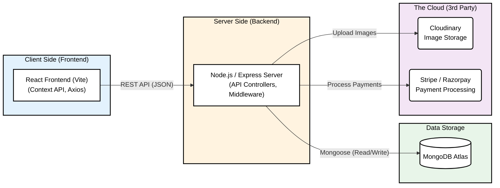
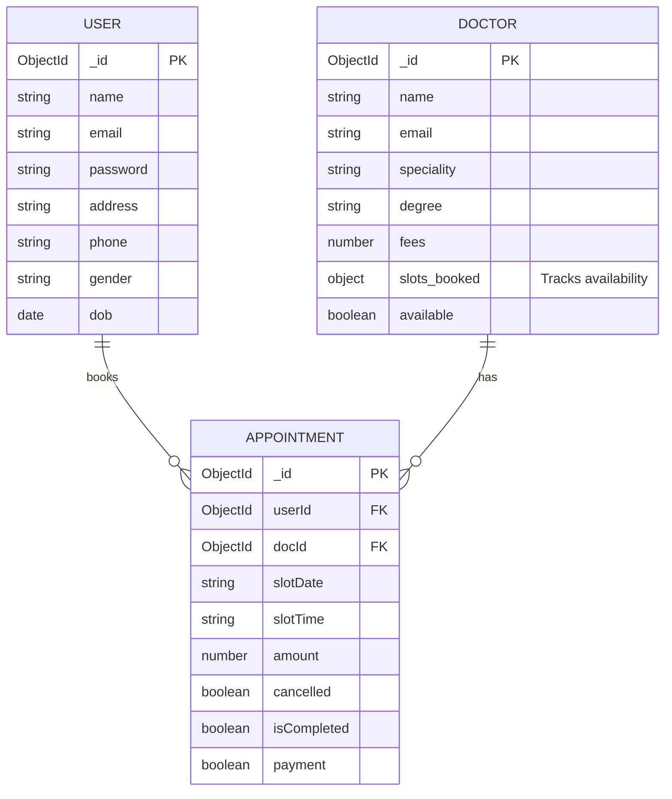
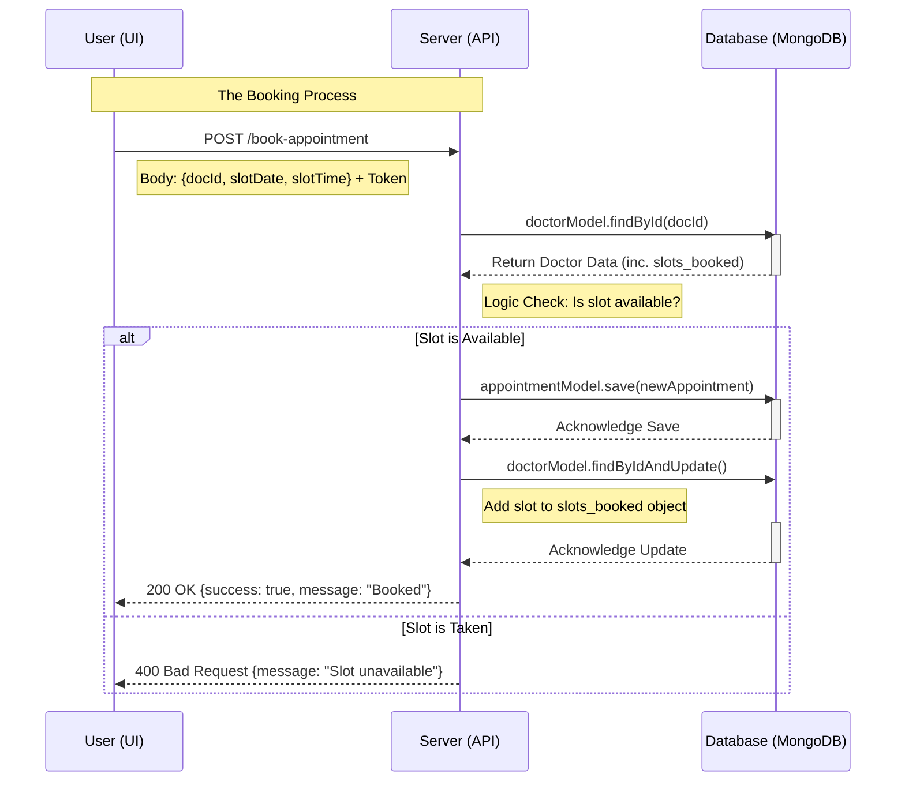

Here are the three specific diagrams tailored to your **Prescripto** project, generated using Mermaid.js syntax. These visualization blocks render the code structures into diagrams.

### 1. High-Level Architecture Diagram

**The "Bird's Eye View"**
This diagram illustrates how your Frontend (Vite), Backend (Node/Express), and Database (MongoDB) communicate, along with external services like Cloudinary and Payment Gateways.

---

### 2. Entity Relationship Diagram (ERD)

**The Data Map**
This diagram demonstrates the relationships between your three core models. It highlights how the **Appointment** entity acts as the "Connector" (Junction) between the **User** and the **Doctor**.

---

### 3. Sequence Diagram

**The "Booking Flow" Timeline**
This diagram visualizes the exact order of operations when a user clicks "Book Appointment." It proves you understand the asynchronous nature of Node.js and the logic checks required to prevent double-booking.

### 💡 Interview Tips for Explaining These:

1. **Architecture:** when pointing to the arrow between **Client** and **Server**, mention: *"I use **JWT (JSON Web Tokens)** here to ensure that every request from the client is authenticated before the server processes it."*
2. **ERD:** Point to the `slots_booked` field in the Doctor entity and explain: *"I chose to store booked slots directly on the Doctor model as an Object/Map for O(1) constant-time lookups, ensuring fast availability checking."*
3. **Sequence:** Emphasize the **Logic Check** step. Say: *"Before creating the appointment, my server explicitly checks the `slots_booked` array to prevent race conditions where two users might try to book the exact same time simultaneously."*
